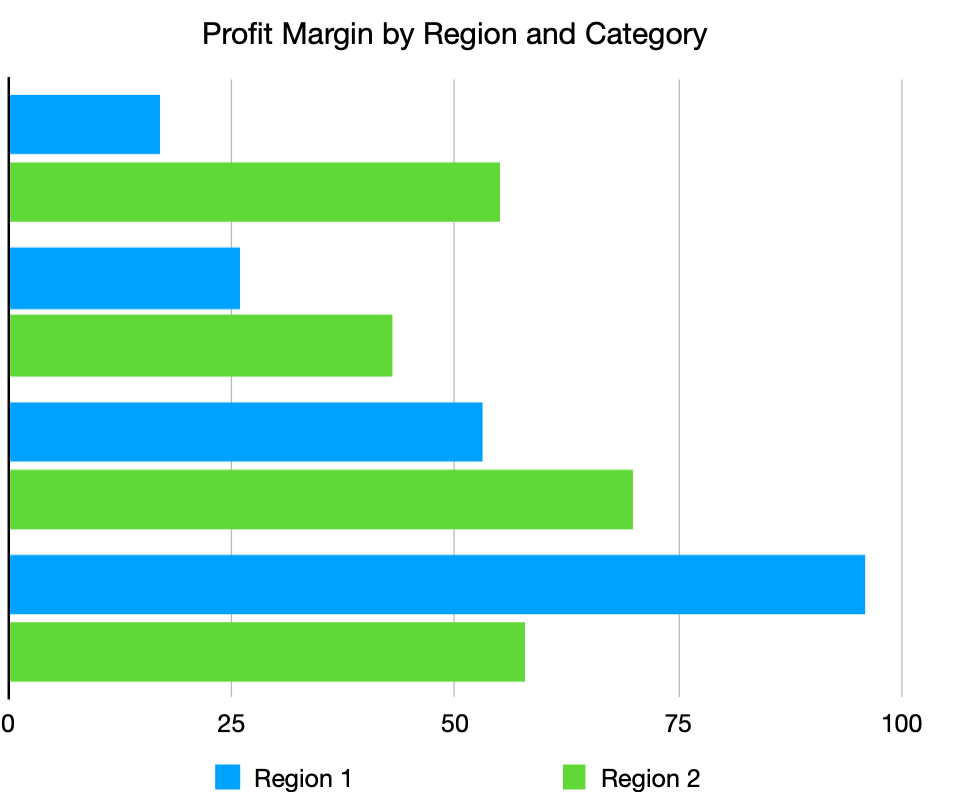
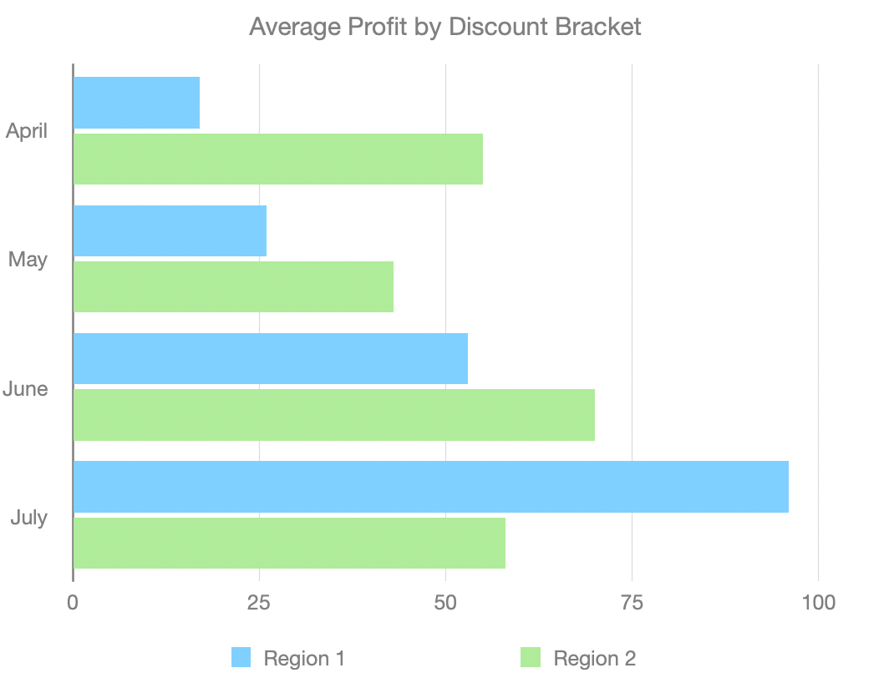
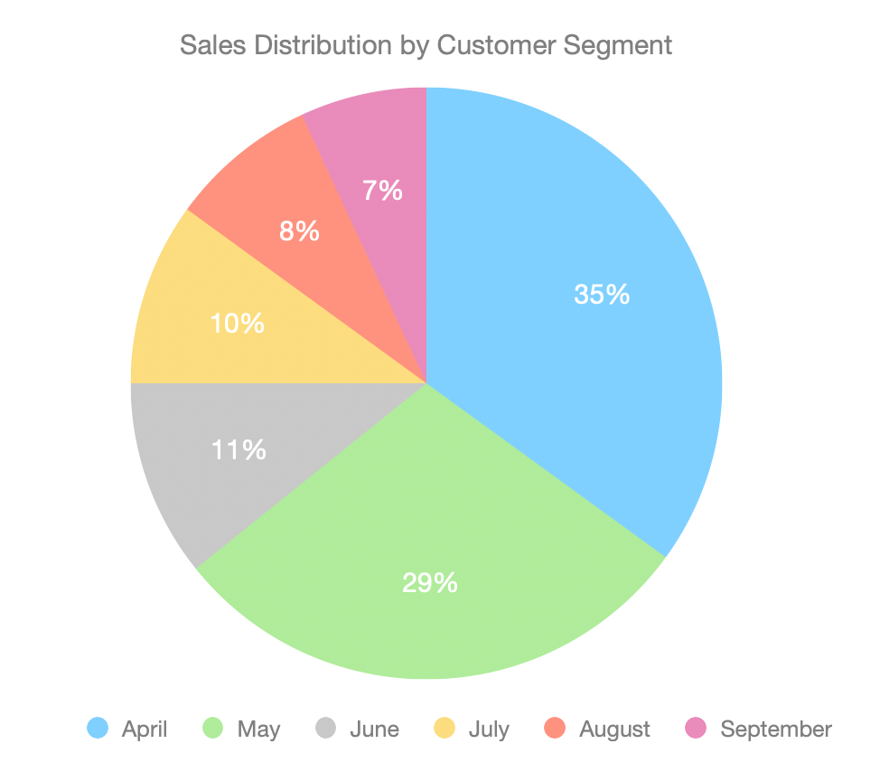

# Retail Sales Performance Analysis

##  Overview
A data analysis project examining retail sales, profit, and discount trends
across regions, categories, and customer segments using SQL and Excel/Numbers.
Built to identify where the business is losing margin and recommend pricing
actions.

##  Business Problem
Leadership wants to understand which regions/categories are underperforming
on profit despite strong sales, and whether current discounting practices
are eroding margin.

##  Dataset
- Source: Sample Superstore Dataset (Kaggle)
- Size: ~9,994 rows
- Fields: Ship mode, segment, country, city, state, postal code, region,
  category, sub-category, sales, quantity, discount, profit

## Tools Used
- MySQL — data storage, cleaning, and querying
- MySQL Workbench — schema design and SQL analysis
- Numbers (Excel-equivalent) — data visualization

##  Process
1. **Schema Design**: Loaded the Superstore CSV into a MySQL table
   (`retail_analysis.sales`) with appropriate data types for each field
2. **Data Import**: Verified successful import of all 9,994 rows via MySQL
   Workbench's Table Data Import Wizard
3. **SQL Analysis**: Wrote aggregate queries to answer key business questions
   around profitability, discounting, and customer segments (see `/sql`
   folder)
4. **Visualization**: Exported query results as CSVs and built charts in
   Numbers to visualize the findings

## Key Business Questions Answered
- Which regions/categories have the highest profit vs. highest revenue?
- At what discount level does profit turn negative?
- Which customer segment is most profitable relative to its sales volume?

## Key Insights

**1. Central region's Furniture category is unprofitable overall**
Central Furniture generated ₹1.63L in sales but posted a net loss
(-₹2,871, a -1.75% margin) — the only region/category combination in the
entire dataset with negative profit. In contrast, East region's Technology
category delivered the strongest margin at 17.9%.

**2. Discounting above 20% is the direct cause of Central Furniture's losses**
Orders with no discount averaged +₹106.68 profit each. Once discounts
crossed 20%, average profit per order flipped negative (-₹54.78 in the
21-40% bracket, -₹65.73 in the 40%+ bracket). This points to discount
policy — not the products themselves — as the source of the region's
negative margin.

**3. The Consumer segment has the highest volume but the weakest margin**
Consumer accounts for the largest share of both order volume (5,191 orders)
and revenue (₹11.6L), but yields the lowest profit margin (11.5%) of the
three segments. Home Office, despite generating the least revenue, is the
most profitable segment by margin (14.0%).

## Dashboard Preview

## Repository Structure
├── sql/ # schema and analysis query files
├── dashboard_*.png # chart images
└── README.md

## How to Run
1. Import `data/superstore.csv` into MySQL using the schema in `sql/schema.sql`
2. Run queries in `sql/analysis_queries.sql`
3. Export results as CSV and visualize in Excel/Numbers/Power BI

## Author
Inchara M — inchara.094@gmail.com
